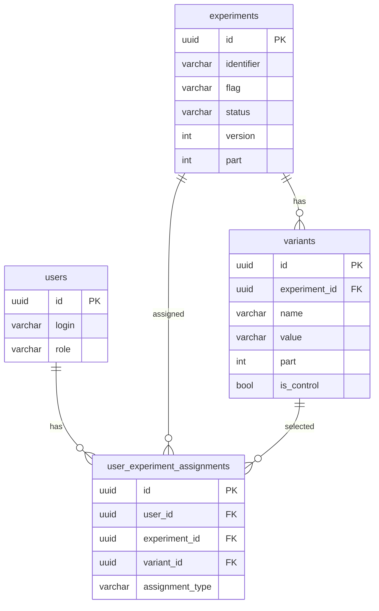

## Требования:
+ docker
+ docker compose

## Запуск:
```cmd 
docker compose up --build
```

## Технологии
- Go `1.25.1`
- Gin (`github.com/gin-gonic/gin`) — HTTP API
- GORM (`gorm.io/gorm`) + PostgreSQL driver (`gorm.io/driver/postgres`) — ORM и работа с БД
- PostgreSQL `16` — основная база данных
- Docker + Docker Compose — локальный запуск и оркестрация контейнеров

## Структура проекта

### Корень проекта
- `docs.md` - документация по запуску и структуре.
- `src/` - исходный код backend-сервиса.

### `src/`
- `main.go` - точка входа приложения: подключение БД, миграции, инициализация зависимостей, запуск HTTP-сервера.
- `go.mod`, `go.sum` - зависимости Go-модуля.
- `Dockerfile.web` - сборка backend-контейнера.
- `.dockerignore` - исключения для docker build.

### `src/database/`
- `postgres.go` - подключение к PostgreSQL и `AutoMigrate` моделей.

### `src/exceptions/`
- `exceptions.go` - централизованные ошибки домена/сервиса (`ErrInvalidInput`, `ErrUserNotFound` и т.д.).

### `src/repository/`
- `models.go` - GORM-модели (`User`, `Experiment`, `Variant`, `UserExperimentAssignment`) и константы типов назначения.
- `user_repository.go` - работа с пользователями и назначениями экспериментов.
- `experiments_repository.go` - работа с экспериментами (создание, поиск, смена статуса).

### `src/services/`
- `user_service.go` - бизнес-логика пользователей.
- `experiments_service.go` - бизнес-логика экспериментов (валидация, ограничения по статусам).
- `feature_service.go` - выдача фичи пользователю и логика участия/неучастия в эксперименте.
- `health_service.go` - health/ready логика.
- `validation.go` - функции валидации входных значений.

### `src/services/inputs/`
- `user.go` - входные структуры для user-сервиса.
- `experiments.go` - входные структуры для experiments-сервиса.
- `feature.go` - входные структуры для feature-сервиса.

### `src/handlers/`
- `user_handler.go` - HTTP-обработчики пользователей.
- `experiments_handler.go` - HTTP-обработчики экспериментов.
- `feature_handler.go` - HTTP-обработчик получения feature-значения.
- `health_handler.go` - HTTP-обработчики health/ready.

### `src/handlers/requests/`
- `user.go` - request-структуры пользователей.
- `experiments.go` - request-структуры экспериментов.
- `feature.go` - request-структура получения feature.

### `src/routes/`
- `router.go` - базовая конфигурация роутера.
- `register_routes.go` - регистрация v1 API-роутов и групп эндпоинтов.

## Схема базы данных (SQL)
```sql
CREATE TABLE users (
    id uuid PRIMARY KEY,
    login varchar(64) NOT NULL UNIQUE,
    role varchar(32) NOT NULL,
    created_at timestamptz NOT NULL DEFAULT now(),
    updated_at timestamptz NOT NULL DEFAULT now()
);

CREATE TABLE experiments (
    id uuid PRIMARY KEY,
    identifier varchar(255) NOT NULL,
    flag varchar(255) NOT NULL,
    name varchar(255) NOT NULL,
    status varchar(255) NOT NULL,
    version integer NOT NULL,
    part integer NOT NULL,
    created_at timestamptz NOT NULL DEFAULT now(),
    updated_at timestamptz NOT NULL DEFAULT now()
);

CREATE TABLE variants (
    id uuid PRIMARY KEY,
    experiment_id uuid NOT NULL REFERENCES experiments(id) ON UPDATE CASCADE ON DELETE CASCADE,
    name varchar(255) NOT NULL,
    value varchar(255) NOT NULL,
    part integer NOT NULL,
    is_control boolean NOT NULL,
    created_at timestamptz NOT NULL DEFAULT now(),
    updated_at timestamptz NOT NULL DEFAULT now()
);
CREATE INDEX idx_variants_experiment_id ON variants(experiment_id);

CREATE TABLE user_experiment_assignments (
    id uuid PRIMARY KEY,
    user_id uuid NOT NULL REFERENCES users(id) ON UPDATE CASCADE ON DELETE CASCADE,
    experiment_id uuid NOT NULL REFERENCES experiments(id) ON UPDATE CASCADE ON DELETE CASCADE,
    variant_id uuid NOT NULL REFERENCES variants(id) ON UPDATE CASCADE ON DELETE CASCADE,
    assignment_type varchar(32) NOT NULL DEFAULT 'participating',
    created_at timestamptz NOT NULL DEFAULT now(),
    updated_at timestamptz NOT NULL DEFAULT now(),
    CONSTRAINT idx_user_experiment_assignment UNIQUE (user_id, experiment_id)
);
CREATE INDEX idx_user_experiment_assignments_user_id ON user_experiment_assignments(user_id);
CREATE INDEX idx_user_experiment_assignments_experiment_id ON user_experiment_assignments(experiment_id);
CREATE INDEX idx_user_experiment_assignments_assignment_type ON user_experiment_assignments(assignment_type);
```
Диаграмма:


## API: эндпоинты и примеры входных данных

Базовый префикс всех эндпоинтов: `/api/v1`

### 1) `GET /api/v1/health`
Проверка liveliness. Тело запроса не требуется.

### 2) `GET /api/v1/ready`
Проверка readiness. Тело запроса не требуется.

### 3) `POST /api/v1/users`
Создание пользователя. Простое создание, не регистрация. Поля валидируются, проверяется, что пользователя с таким логином нет.

Успешный пример:
```json
{
  "login": "john.doe_1",
  "role": "admin"
}
```

Граничный успешный пример (максимальные длины):
```json
{
  "login": "aaaaaaaaaaaaaaaaaaaaaaaaaaaaaaaaaaaaaaaaaaaaaaaaaaaaaaaaaaaaaaaa",
  "role": "rrrrrrrrrrrrrrrrrrrrrrrrrrrrrrrr"
}
```

Граничный неуспешный пример:
```json
{
  "login": "john doe",
  "role": "admin"
}
```
Причина: `login` не проходит валидацию (пробелы запрещены, допустимы `[A-Za-z0-9._-]`).

### 4) `GET /api/v1/users/list`
Список пользователей. Тело запроса не требуется. Просто вспомогательный эндпоинт.

### 5) `POST /api/v1/experiments`
Создание эксперимента. Добавление эксперимента, вариантов в бд. Проверяется, что другого активного/на паузе эсперимента с этим флагом нет, что сумма долей варинтов равна доле эксперимента, только один вариант контрольный. Поля валидируются. Может создавать кто угодно. Значения у вариантов только строка, нет поддержки DSL на пользователей(таргетинг).

Успешный пример:
```json
{
  "identifier": "exp_checkout_v2",
  "flag": "checkout_redesign",
  "name": "Checkout redesign experiment",
  "status": "draft",
  "version": 1,
  "part": 100,
  "variants": [
    {
      "name": "control",
      "value": "old_flow",
      "part": 50,
      "is_control": true
    },
    {
      "name": "test",
      "value": "new_flow",
      "part": 50,
      "is_control": false
    }
  ]
}
```

Граничный успешный пример (минимально валидный набор):
```json
{
  "identifier": "exp1",
  "flag": "f1",
  "name": "A",
  "status": "review",
  "version": 1,
  "part": 1,
  "variants": [
    {
      "name": "c",
      "value": "v",
      "part": 1,
      "is_control": true
    }
  ]
}
```

Граничные неуспешные примеры:
```json
{
  "identifier": "exp_bad_sum",
  "flag": "checkout_redesign",
  "name": "Bad parts sum",
  "status": "draft",
  "version": 1,
  "part": 100,
  "variants": [
    {
      "name": "control",
      "value": "old_flow",
      "part": 40,
      "is_control": true
    },
    {
      "name": "test",
      "value": "new_flow",
      "part": 40,
      "is_control": false
    }
  ]
}
```
Причина: сумма `variants[].part` должна быть равна `part`.


После первого запроса:
```json
{
  "identifier": "exp_second_active",
  "flag": "checkout_redesign",
  "name": "Second active",
  "status": "active",
  "version": 2,
  "part": 100,
  "variants": [
    {
      "name": "control",
      "value": "old_flow",
      "part": 50,
      "is_control": true
    },
    {
      "name": "test",
      "value": "new_flow",
      "part": 50,
      "is_control": false
    }
  ]
}
```
Причина: для одного `flag` нельзя иметь более одного эксперимента в `active` или `pause`.

### 6) `PATCH /api/v1/experiments`
Смена статуса эксперимента по `identifier`. Просто смена на один из возможных варивнтов статуса. Проверяется, что другого активного/на паузе эксперимента с этим флагом нет. Поля валидируются. Может совершать кто угодно.

Успешный пример:
```json
{
  "identifier": "exp_checkout_v2",
  "status": "active"
}
```

Граничный успешный пример:
```json
{
  "identifier": "exp_checkout_v2",
  "status": "pause"
}
```

Граничный неуспешный пример:
```json
{
  "identifier": "exp_checkout_v2",
  "status": "active"
}
```
Причина: если другой эксперимент с тем же `flag` уже в `active` или `pause`, вернется ошибка.

### 7) `POST /api/v1/feature`
Получение значения фичи для пользователя. Поддерживается детерминированность(вариант эксперимента не меняется), учитываются веса как вариантов, так и эсперимента в целом. Нет DSL. Поля валидируются.

Успешный пример:
```json
{
  "feature_name": "checkout_redesign",
  "person_id": "123e4567-e89b-12d3-a456-426614174000",
  "fallback_value": "old_flow"
}
```

Граничный успешный пример:
```json
{
  "feature_name": "f1",
  "person_id": "123e4567-e89b-12d3-a456-426614174000",
  "fallback_value": "x"
}
```

Граничный неуспешный пример:
```json
{
  "feature_name": "checkout redesign",
  "person_id": "not-a-uuid",
  "fallback_value": "old_flow"
}
```
Причина: `feature_name` должен быть slug-строкой, `person_id` должен быть UUID.

### Дополнительно по валидации
- Допустимые статусы эксперимента: `draft`, `review`, `approved`, `active`, `pause`, `completed`, `archive`, `rejected`.
- `identifier` и `flag`: латиница/цифры/`_`/`.`/`:`/`-`, первый символ - буква, длина до 255.
- `login`: `[A-Za-z0-9._-]`, длина до 64.
- `role`: `[A-Za-z0-9_-]`, длина до 32.
- `default_value`, `name`, `variant.value`: печатные символы, ограничение длины по коду.

## Матрица соответствия (п.5 criteria.md)

| ID задания | ID критерия | Проблема/риск | Где реализовано | Как проверяется | Какие данные нужны | Статус |
|---|---|---|---|---|---|---|
| `D.4` | `B1-1` | Без предусловий запуск невоспроизводим. | `docs.md` (разделы "Требования", "Запуск"). | Проверить наличие списка зависимостей и команды запуска. | Docker, Docker Compose. | `выполнено` |
| `D.4` | `B1-2` | Неоднозначный старт системы. | `docs.md` (команда `docker compose up --build`). | Выполнить команду из документации. | Локальная машина с Docker. | `выполнено` |
| `D.4` | `B1-3` | Скрытые шаги ломают запуск у жюри. | `docker-compose.yml`, `docs.md`. | Запустить только по инструкции, без ручных правок кода. | Чистая среда и репозиторий. | `выполнено` |
| `3.7` | `B1-4` | Сервис не выходит в рабочее состояние. | `src/main.go`, `src/handlers/health_handler.go`. | Проверить `GET /api/v1/ready` и `GET /api/v1/health`. | Запущенный стек из docker compose. | `выполнено` |
| `D.5` | `B1-5` | Нет сквозного потока принятия решения и отчётности. | Частично: `src/handlers/feature_handler.go`, `src/services/feature_service.go`. | Вызвать `POST /api/v1/feature` для получения варианта. | Пользователь + эксперимент + флаг. | `частично` |
| `1.3, 3.4` | `B2-1` | Без активного эксперимента возвращается не `default`. | `src/services/feature_service.go` (финальный fallback). | `POST /feature` для флага без активного эксперимента. | Флаг без active-эксперимента, `fallback_value`. | `выполнено` |
| `1.3, 3.4` | `B2-2` | Пользователь вне участия получает variant. | `src/services/feature_service.go` (`AssignmentTypeNotParticipating`). | `POST /feature`, подобрать пользователя, не прошедшего участие. | Активный эксперимент + пользователь. | `частично` |
| `1.3, 3.4` | `B2-3` | Пользователь в участии получает `default`. | `src/services/feature_service.go` (`AssignmentTypeParticipating`). | `POST /feature`, подобрать пользователя, прошедшего участие. | Активный эксперимент + пользователь. | `частично` |
| `3.5.1` | `B2-4` | Нестабильный результат при тех же входах. | `src/services/feature_service.go` (`hashToUint64`, `hashToPercent`). | Повторить `POST /feature` для того же `person_id`/флага. | Один и тот же `person_id`, `feature_name`. | `выполнено` |
| `2.2, 3.4` | `B2-5` | Раздача не соответствует весам вариантов. | `src/services/feature_service.go` (`pickVariantByPart`). | Массово вызвать `POST /feature` по разным user_id и сравнить доли. | Набор пользователей и варианты с весами. | `выполнено` |
| `2.3.1, 2.5` | `B3-4` | Разрешены недопустимые переходы статусов. | Частично: `src/services/experiments_service.go` (блокировка 2 active/pause на flag). | Проверить конфликт при активации второго эксперимента. | 2 эксперимента с одним `flag`. | `частично` |
| `3.6` | `B5-6` | Пользователь слишком часто участвует в экспериментах | Логика(формула) в `src/services/feature_service.go`(по матожиданию при увелечении экспериментов распределение будет выравниваться). | Вызов `POST /feature` для одного пользователя разных экспериментов | Один `person_id`, несколько разных экспериментов. | `выполнено` |
| `D.5` | `B7-1` | Непонятный нейминг сущностей/эндпоинтов. | `src/`. | Ручной просмотр доменных имён и API. | Кодовая база. | `выполнено` |
| `D.5` | `B7-2` | Смешаны ответственности модулей. | Слои `handlers -> services -> repository`. | Проверить прохождение запроса по слоям. | Кодовая база. | `выполнено` |
| `D.6` | `B7-3` | Нет трассируемости критериев в код. | Этот раздел `docs.md` (матрица соответствия). | Проверить заполненность таблицы и ссылки на реализацию. | `docs.md`, исходники. | `выполнено` |
| `D.5` | `B7-4` | Архитектурные решения и ограничения не зафиксированы явно. | `docs.md` (структура и API, общее описание). | Проверка наличия ADR/раздела решений. | Документация проекта. | `выполнено` |
| `D.5` | `B7-8` | Нет карты репозитория. | `docs.md` (раздел "Структура проекта"). | Проверить наличие карты директорий и входных точек. | `docs.md`. | `выполнено` |
| `D.7.3` | `B7-9` | Ограничения/упрощения не зафиксированы. | `docs.md` (валидации, текущие API-границы). | Проверить отдельный список ограничений. | `docs.md`. | `выполнено` |
| `3.7` | `B9-1` | Неоднозначный readiness. | `src/handlers/health_handler.go`, `src/main.go`. | `GET /api/v1/ready` после старта сервиса. | Запущенный backend. | `выполнено` |
| `3.7` | `B9-2` | Нет/неверный liveness. | `src/handlers/health_handler.go`. | `GET /api/v1/health` должен вернуть `200`. | Запущенный backend. | `выполнено` |
| `2.8, D.4` | `B9-4` | Формат логов может быть непоследовательным и усложнять анализ. | `logs.txt`, Gin logger middleware (`src/main.go`). | Проверить, что запросы логируются в стабильном формате (метод, путь, код, latency, client ip) по примеру в `logs.txt`. | Логи запуска и несколько HTTP-запросов. | `выполнено` |
| `2.8, D.5` | `B9-6` | Не описано поведение под ростом нагрузки. | Частично: индексы в моделях GORM. | Ревью индексов + стресс-сценарий. | БД с большим объёмом данных. | `частично` |
| `2.8, D.5` | `B9-7` | Нет мер эффективности hot-path. | `src/repository/models.go` (индексы через теги GORM). | Проверить индексы в схеме БД после миграции. | PostgreSQL схема после `AutoMigrate`. | `выполнено` |
| `D.4, D.5` | `B10-2` | Нет автоматизированного форматирования. | Применяется `gofmt`, но не оформлено как штатный pipeline/команда в документации. | Проверка наличия команды/скрипта форматирования. | Документация/Makefile/CI. | `частично` |
